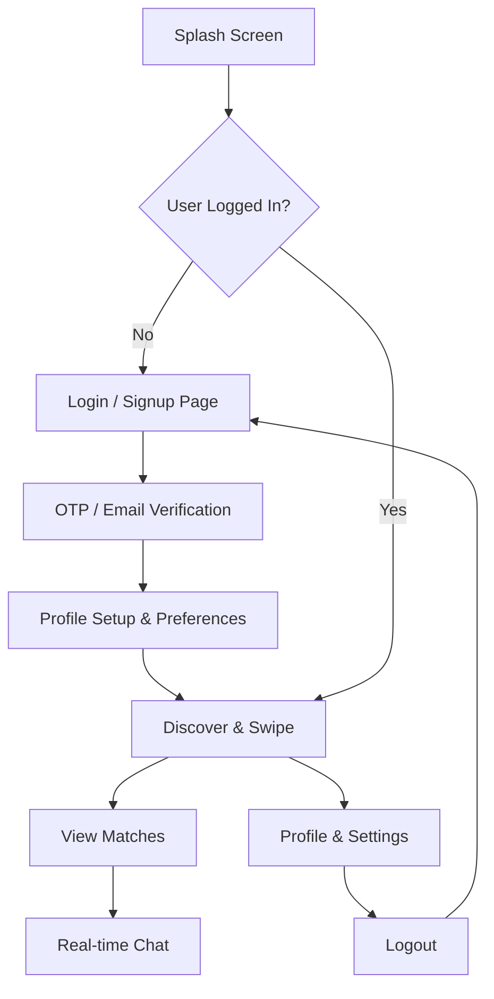
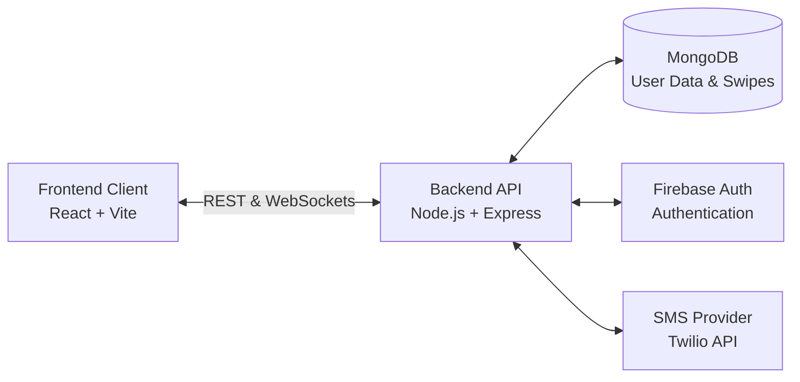
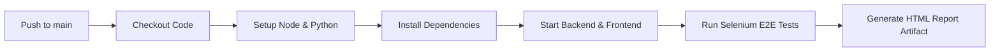

# Romyntra Dating App

Welcome to the **Romyntra Dating App** repository! This is an AI-powered dating application with a rich frontend built with React/Vite and a robust Node.js/Express backend.

## 🗺️ Application User Flow

GitHub automatically renders Mermaid flowcharts! Here is the high-level user journey through the application:

## 🏗️ System Architecture

## 🚀 CI/CD Pipeline

This project uses **GitHub Actions** for automated testing:

## Running Locally

1. Install backend dependencies: `cd backend && npm install`
2. Start backend server: `npm run dev`
3. Install frontend dependencies: `cd frontend && npm install`
4. Start frontend server: `npm run dev`
