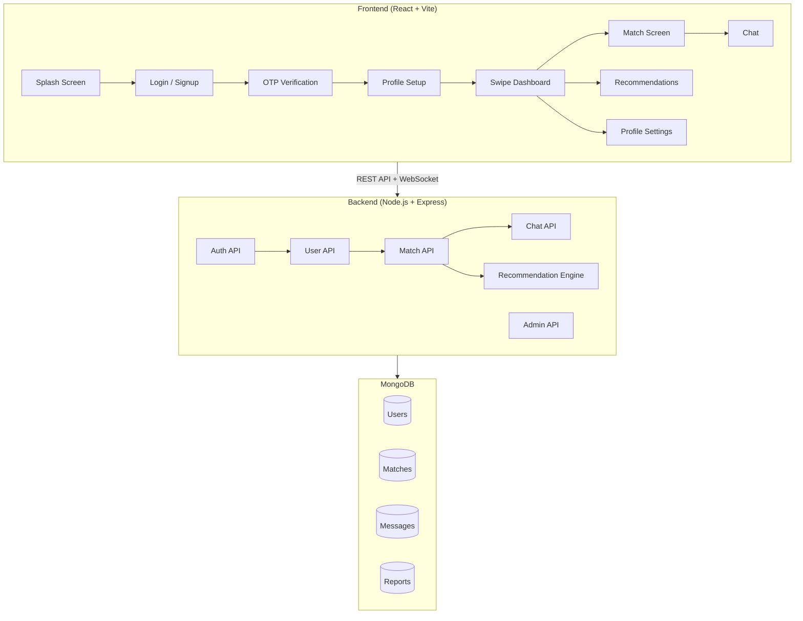

# 💘 Romyntra — Implementation Plan

## Overview

Build **Romyntra**, an AI-powered dating web application with a Tinder-style swipe interface, smart date recommendations, real-time encrypted chat, and an admin dashboard. The app will be built as a **React (Vite) frontend** with a **Node.js/Express/MongoDB backend**.

### Existing State
- **Backend**: Basic Express scaffold with mongoose, cors, dotenv, axios installed. No routes, models, or auth.
- **Frontend**: Default Vite + React template. A `Demo` file exists with recommendation logic (shadcn/ui-based, not integrated).
- **Decision**: We'll rebuild both from scratch within the existing project structure, preserving useful recommendation logic from the Demo file.

---
## User Review Required

> [!IMPORTANT]
> **MongoDB Connection**: You'll need a MongoDB Atlas connection string (or local MongoDB). I'll set up the `.env` template — you'll fill in credentials.

> [!IMPORTANT]
> **Firebase vs Mock Auth**: Full Firebase Phone Auth and Storage require a Firebase project with billing. For this build, I'll implement:
> - **JWT-based auth** with bcrypt password hashing (fully working)
> - **Mock OTP verification** flow (simulates the real flow, easily swappable to Firebase)
> - **Local file upload** with Cloudinary-ready architecture
> 
> Would you prefer I set up real Firebase integration if you have a project ready?

> [!WARNING]
> **Scope Management**: This is a very large project. I'll build it in phases, delivering a fully working MVP first, then layering on advanced features. Each phase will be functional and testable independently.

---

## Open Questions

1. **Database**: Do you have a MongoDB Atlas URI ready, or should I set up for local MongoDB?
2. **Firebase**: Do you have a Firebase project configured? If yes, share the config and I can wire up real OTP + Storage.
3. **Deployment**: Any specific deployment targets (Vercel, Render, etc.) to keep in mind?
4. **Dummy Data**: Should I seed the database with sample user profiles for demo purposes?

---

## Architecture

---

## Proposed Changes

### Phase 1: Foundation & Authentication

---

#### Backend — Core Setup

##### [MODIFY] [server.js](file:///c:/Users/aravi/OneDrive/Desktop/PDD/backend/server.js)
- Complete rewrite as the application entry point
- MongoDB connection with mongoose
- CORS, body parsing, rate limiting middleware
- Route mounting for all API modules
- Socket.IO initialization for real-time chat
- Global error handler

##### [NEW] [.env.example](file:///c:/Users/aravi/OneDrive/Desktop/PDD/backend/.env.example)
- Template with `MONGO_URI`, `JWT_SECRET`, `PORT`, `CLOUDINARY_*` variables

##### [NEW] [config/db.js](file:///c:/Users/aravi/OneDrive/Desktop/PDD/backend/config/db.js)
- MongoDB connection utility with retry logic

##### [NEW] [middleware/auth.js](file:///c:/Users/aravi/OneDrive/Desktop/PDD/backend/middleware/auth.js)
- JWT token verification middleware
- Role-based access control (user/admin)
- `protect` and `adminOnly` middleware functions

##### [NEW] [middleware/errorHandler.js](file:///c:/Users/aravi/OneDrive/Desktop/PDD/backend/middleware/errorHandler.js)
- Centralized error handling with proper HTTP status codes

##### [NEW] [models/User.js](file:///c:/Users/aravi/OneDrive/Desktop/PDD/backend/models/User.js)
- User schema: name, email, phone, password (hashed), age, gender, bio, photos[], interests[], cuisinePreferences[], movieGenres[], ambiencePreferences[], budgetRange, location, role (user/admin), isVerified, isRestricted, createdAt

##### [NEW] [routes/auth.js](file:///c:/Users/aravi/OneDrive/Desktop/PDD/backend/routes/auth.js)
- `POST /api/auth/register` — signup with validation
- `POST /api/auth/login` — login with JWT
- `POST /api/auth/verify-otp` — mock OTP verification
- `POST /api/auth/send-otp` — generate and send mock OTP
- `POST /api/auth/verify-email` — email verification flow

##### [NEW] [controllers/authController.js](file:///c:/Users/aravi/OneDrive/Desktop/PDD/backend/controllers/authController.js)
- Registration with bcrypt hashing, age validation (18+)
- Login with JWT generation
- OTP generation & verification logic
- Token refresh

##### [NEW] [utils/generateToken.js](file:///c:/Users/aravi/OneDrive/Desktop/PDD/backend/utils/generateToken.js)
- JWT token creation utility

---

### Phase 2: User Profiles & Swipe System

---

#### Backend — User & Swipe APIs

##### [NEW] [routes/users.js](file:///c:/Users/aravi/OneDrive/Desktop/PDD/backend/routes/users.js)
- `GET /api/users/profile` — get own profile
- `PUT /api/users/profile` — update profile
- `POST /api/users/photos` — upload photos
- `GET /api/users/discover` — get swipeable profiles (excludes already swiped)
- `DELETE /api/users/photos/:id` — remove photo

##### [NEW] [controllers/userController.js](file:///c:/Users/aravi/OneDrive/Desktop/PDD/backend/controllers/userController.js)
- Profile CRUD with validation
- Discovery feed algorithm (filter by preferences, location, exclude seen)
- Photo management

##### [NEW] [routes/swipe.js](file:///c:/Users/aravi/OneDrive/Desktop/PDD/backend/routes/swipe.js)
- `POST /api/swipe/like` — like a profile
- `POST /api/swipe/pass` — pass on a profile
- `POST /api/swipe/superlike` — super like

##### [NEW] [models/Swipe.js](file:///c:/Users/aravi/OneDrive/Desktop/PDD/backend/models/Swipe.js)
- Schema: swiperId, swipedId, action (like/pass/superlike), timestamp

##### [NEW] [controllers/swipeController.js](file:///c:/Users/aravi/OneDrive/Desktop/PDD/backend/controllers/swipeController.js)
- Swipe handling with mutual match detection
- Auto-create Match document on mutual like

---

### Phase 3: Matching & Smart Recommendations

---

##### [NEW] [models/Match.js](file:///c:/Users/aravi/OneDrive/Desktop/PDD/backend/models/Match.js)
- Schema: user1, user2, matchScore, recommendations, matchedAt, status

##### [NEW] [routes/matches.js](file:///c:/Users/aravi/OneDrive/Desktop/PDD/backend/routes/matches.js)
- `GET /api/matches` — list all matches
- `GET /api/matches/:id` — get match with recommendations
- `GET /api/matches/:id/recommendations` — get date recommendations

##### [NEW] [controllers/matchController.js](file:///c:/Users/aravi/OneDrive/Desktop/PDD/backend/controllers/matchController.js)
- Match retrieval and management

##### [NEW] [services/recommendationEngine.js](file:///c:/Users/aravi/OneDrive/Desktop/PDD/backend/services/recommendationEngine.js)
- **Compatibility scoring** based on shared interests, cuisine, movies, ambience, budget overlap
- **Restaurant recommendations** from curated data, filtered by shared city, cuisine, budget, ambience
- **Movie recommendations** based on shared genre preferences
- **Smart date scheduling** — generates time-blocked date plans
- Adapted from the existing Demo file's logic but enhanced

##### [NEW] [data/restaurants.json](file:///c:/Users/aravi/OneDrive/Desktop/PDD/backend/data/restaurants.json)
- Expanded curated restaurant dataset (20+ entries across multiple cities)

##### [NEW] [data/movies.json](file:///c:/Users/aravi/OneDrive/Desktop/PDD/backend/data/movies.json)
- Curated movie dataset with genres, ratings, modes

---

### Phase 4: Real-Time Chat

---

##### [NEW] [models/Message.js](file:///c:/Users/aravi/OneDrive/Desktop/PDD/backend/models/Message.js)
- Schema: matchId, senderId, content (encrypted), messageType, timestamp, readAt

##### [NEW] [routes/chat.js](file:///c:/Users/aravi/OneDrive/Desktop/PDD/backend/routes/chat.js)
- `GET /api/chat/:matchId` — get message history
- `POST /api/chat/:matchId` — send message (REST fallback)

##### [NEW] [controllers/chatController.js](file:///c:/Users/aravi/OneDrive/Desktop/PDD/backend/controllers/chatController.js)
- Message persistence with simple encryption (AES-256)
- Message history pagination

##### [NEW] [services/socketHandler.js](file:///c:/Users/aravi/OneDrive/Desktop/PDD/backend/services/socketHandler.js)
- Socket.IO event handlers for real-time messaging
- Online status tracking
- Typing indicators
- Message delivery confirmations

##### [NEW] [utils/encryption.js](file:///c:/Users/aravi/OneDrive/Desktop/PDD/backend/utils/encryption.js)
- AES-256 encrypt/decrypt utilities for message content

---

### Phase 5: Admin Panel & Moderation

---

##### [NEW] [routes/admin.js](file:///c:/Users/aravi/OneDrive/Desktop/PDD/backend/routes/admin.js)
- `GET /api/admin/users` — list all users with filters
- `PUT /api/admin/users/:id/restrict` — restrict/unrestrict user
- `GET /api/admin/reports` — get all reports
- `PUT /api/admin/reports/:id` — resolve report
- `GET /api/admin/analytics` — platform analytics
- `DELETE /api/admin/users/:id` — remove user

##### [NEW] [models/Report.js](file:///c:/Users/aravi/OneDrive/Desktop/PDD/backend/models/Report.js)
- Schema: reporterId, reportedId, reason, description, status, createdAt

##### [NEW] [controllers/adminController.js](file:///c:/Users/aravi/OneDrive/Desktop/PDD/backend/controllers/adminController.js)
- User management (view, restrict, delete)
- Report handling and resolution
- Analytics aggregation (total users, matches, messages, active users)

##### [NEW] [routes/reports.js](file:///c:/Users/aravi/OneDrive/Desktop/PDD/backend/routes/reports.js)
- `POST /api/reports` — submit a report (user-facing)

---

### Frontend — Complete React Application

---

#### Core Setup & Design System

##### [MODIFY] [index.html](file:///c:/Users/aravi/OneDrive/Desktop/PDD/frontend/index.html)
- Update title, meta tags, Google Fonts (Inter/Outfit), favicon

##### [MODIFY] [src/index.css](file:///c:/Users/aravi/OneDrive/Desktop/PDD/frontend/src/index.css)
- Complete design system with CSS custom properties
- Premium color palette (rose/pink gradients, dark mode support)
- Typography scale using Inter/Outfit fonts
- Glassmorphism utilities
- Swipe card animations
- Smooth transitions and micro-animations
- Responsive breakpoints

##### [MODIFY] [src/App.jsx](file:///c:/Users/aravi/OneDrive/Desktop/PDD/frontend/src/App.jsx)
- React Router setup with all routes
- Auth context provider
- Protected route wrapper

##### [MODIFY] [src/main.jsx](file:///c:/Users/aravi/OneDrive/Desktop/PDD/frontend/src/main.jsx)
- BrowserRouter wrapper, context providers

#### Authentication & Onboarding Screens

##### [NEW] [src/contexts/AuthContext.jsx](file:///c:/Users/aravi/OneDrive/Desktop/PDD/frontend/src/contexts/AuthContext.jsx)
- Auth state management (user, token, loading)
- Login, register, logout functions
- Token persistence in localStorage

##### [NEW] [src/services/api.js](file:///c:/Users/aravi/OneDrive/Desktop/PDD/frontend/src/services/api.js)
- Axios instance with base URL and auth interceptor
- API functions for all endpoints

##### [NEW] [src/pages/SplashScreen.jsx](file:///c:/Users/aravi/OneDrive/Desktop/PDD/frontend/src/pages/SplashScreen.jsx)
- Animated Romyntra logo with heartbeat animation
- Gradient background with floating hearts
- Auto-redirect after 3 seconds

##### [NEW] [src/pages/LoginPage.jsx](file:///c:/Users/aravi/OneDrive/Desktop/PDD/frontend/src/pages/LoginPage.jsx)
- Beautiful login form with gradient backdrop
- Email/password login
- "Sign up" link
- Social login buttons (visual only for MVP)

##### [NEW] [src/pages/SignupPage.jsx](file:///c:/Users/aravi/OneDrive/Desktop/PDD/frontend/src/pages/SignupPage.jsx)
- Multi-step registration form
- Name, email, phone, password fields
- Age verification (18+ check with DOB picker)
- Terms acceptance

##### [NEW] [src/pages/OTPVerification.jsx](file:///c:/Users/aravi/OneDrive/Desktop/PDD/frontend/src/pages/OTPVerification.jsx)
- 6-digit OTP input with auto-focus
- Countdown timer for resend
- Beautiful animated verification screen

##### [NEW] [src/pages/ProfileSetup.jsx](file:///c:/Users/aravi/OneDrive/Desktop/PDD/frontend/src/pages/ProfileSetup.jsx)
- Multi-step profile builder:
  1. Photo upload (drag & drop, up to 6 photos)
  2. Bio and basic info (gender, looking for)
  3. Interests selection (chip-based multi-select)
  4. Date preferences (cuisines, movie genres, ambience, budget slider)
- Progress indicator
- Animated transitions between steps

#### Main App Screens

##### [NEW] [src/pages/DiscoverPage.jsx](file:///c:/Users/aravi/OneDrive/Desktop/PDD/frontend/src/pages/DiscoverPage.jsx)
- **Tinder-style swipe card stack** — the centerpiece
- Profile cards with photos, name, age, bio, interests
- Swipe right (like), left (pass), up (super like)
- Touch/mouse drag swipe with spring physics
- Action buttons (pass, super like, like)
- "It's a Match!" popup animation on mutual like

##### [NEW] [src/pages/MatchesPage.jsx](file:///c:/Users/aravi/OneDrive/Desktop/PDD/frontend/src/pages/MatchesPage.jsx)
- Grid of matched profiles with photos
- Match score display
- Quick action to chat or view recommendations
- New match highlight animation

##### [NEW] [src/pages/ChatPage.jsx](file:///c:/Users/aravi/OneDrive/Desktop/PDD/frontend/src/pages/ChatPage.jsx)
- Chat list (all matches with last message preview)
- Individual chat view with message bubbles
- Message input with send button
- Online status indicator
- Typing indicator animation
- Socket.IO integration for real-time

##### [NEW] [src/pages/RecommendationsPage.jsx](file:///c:/Users/aravi/OneDrive/Desktop/PDD/frontend/src/pages/RecommendationsPage.jsx)
- Date plan cards (restaurant + movie + schedule)
- Beautiful venue cards with ratings, cuisine tags, price range
- Movie suggestion cards
- Smart date timeline visualization
- "Book This Date" concept button

##### [NEW] [src/pages/ProfilePage.jsx](file:///c:/Users/aravi/OneDrive/Desktop/PDD/frontend/src/pages/ProfilePage.jsx)
- View/edit own profile
- Photo management
- Settings (preferences, notifications)
- Report/block functionality
- Logout

#### Admin Dashboard

##### [NEW] [src/pages/admin/AdminDashboard.jsx](file:///c:/Users/aravi/OneDrive/Desktop/PDD/frontend/src/pages/admin/AdminDashboard.jsx)
- Analytics overview (total users, matches, messages, reports)
- Charts for user growth, match rates
- Recent activity feed

##### [NEW] [src/pages/admin/UserManagement.jsx](file:///c:/Users/aravi/OneDrive/Desktop/PDD/frontend/src/pages/admin/UserManagement.jsx)
- User table with search, filter, pagination
- Restrict/unrestrict, delete actions
- User detail modal

##### [NEW] [src/pages/admin/ReportsPanel.jsx](file:///c:/Users/aravi/OneDrive/Desktop/PDD/frontend/src/pages/admin/ReportsPanel.jsx)
- Report list with status filters
- Report detail with action buttons (warn, restrict, dismiss)

#### Shared Components

##### [NEW] [src/components/Navbar.jsx](file:///c:/Users/aravi/OneDrive/Desktop/PDD/frontend/src/components/Navbar.jsx)
- Bottom navigation bar (Discover, Matches, Chat, Profile)
- Active state indicator with animation
- Notification badges

##### [NEW] [src/components/SwipeCard.jsx](file:///c:/Users/aravi/OneDrive/Desktop/PDD/frontend/src/components/SwipeCard.jsx)
- Individual profile card with photo carousel
- Swipe gesture handling (drag, release, snap)
- Like/Pass/SuperLike overlay indicators
- Smooth spring-physics animations

##### [NEW] [src/components/MatchPopup.jsx](file:///c:/Users/aravi/OneDrive/Desktop/PDD/frontend/src/components/MatchPopup.jsx)
- "It's a Match!" celebration overlay
- Confetti/hearts animation
- Both users' photos displayed
- "Send a Message" / "Keep Swiping" buttons

##### [NEW] [src/components/ProtectedRoute.jsx](file:///c:/Users/aravi/OneDrive/Desktop/PDD/frontend/src/components/ProtectedRoute.jsx)
- Route guard checking auth state
- Redirect to login if unauthenticated
- Admin route protection

---

## Dependency Changes

### Backend — New packages needed:
| Package | Purpose |
|---------|---------|
| `bcryptjs` | Password hashing |
| `jsonwebtoken` | JWT authentication |
| `express-rate-limit` | API rate limiting |
| `socket.io` | Real-time WebSocket communication |
| `multer` | File upload handling |
| `express-validator` | Input validation |
| `crypto` (built-in) | Message encryption |
| `nodemon` (dev) | Auto-restart on changes |

### Frontend — New packages needed:
| Package | Purpose |
|---------|---------|
| `socket.io-client` | WebSocket client |
| `framer-motion` | Animations & swipe gestures |
| `lucide-react` | Premium icon set |
| `react-hot-toast` | Toast notifications |

*(Remove unused: `@react-google-maps/api`)*

---

## Verification Plan

### Automated Tests
1. Start backend: `node server.js` — verify MongoDB connects, API responds at `http://localhost:5000`
2. Start frontend: `npm run dev` — verify app loads at `http://localhost:5173`
3. Browser testing via subagent:
   - Complete signup flow (splash → signup → OTP → profile setup)
   - Swipe through profiles
   - Verify match creation on mutual like
   - Test chat messaging
   - Test recommendation display
   - Test admin dashboard access

### Manual Verification
- Visual quality check of all screens
- Swipe animation smoothness
- Responsive layout on different viewport sizes
- Chat real-time delivery

---

## Execution Order

| Phase | What | Est. Files |
|-------|------|-----------|
| **1** | Backend foundation + Auth + Frontend design system + Splash/Login/Signup | ~20 files |
| **2** | User profiles + Swipe system (backend + frontend) | ~10 files |
| **3** | Matching engine + Recommendations | ~8 files |
| **4** | Real-time chat (Socket.IO) | ~6 files |
| **5** | Admin dashboard + Reports + Polish | ~6 files |

**Total: ~50 files across backend and frontend**

I'll build each phase end-to-end (backend API → frontend UI → integration test) so you have a working app at every checkpoint.
